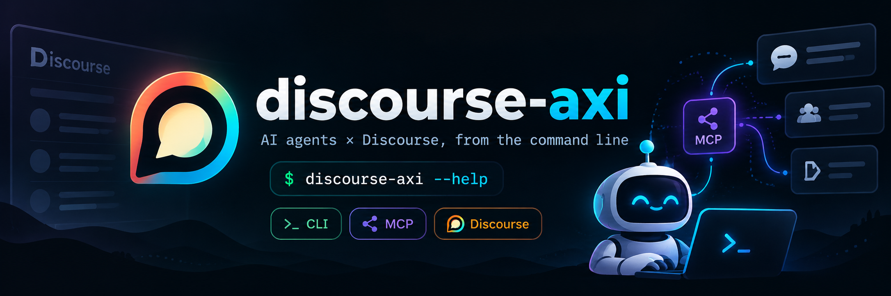

<p align="center">
  
</p>

<h1 align="center">discourse-axi</h1>

<p align="center">A command-line tool that lets AI agents work with Discourse forums.</p>

discourse-axi connects to a forum's built-in MCP server and turns every tool the forum offers into a command. The commands come from the forum itself, so plugin and custom tools show up too, and each command explains its own inputs with `--help`.

## Installation

Requires Node.js 24 or newer.

```sh
npm install --global @nikolauska/discourse-axi
discourse-axi auth login --forum https://forum.example.org
discourse-axi --help
```

To use the same forum every time in a repository, bind it once with `discourse-axi init --forum https://forum.example.org`. Update the CLI later with `discourse-axi update`.

## Learn more

- [Product handbook](https://github.com/nikolauska/discourse-axi/blob/main/docs/domain.md): how forum selection, sign-in, commands, results and limits work.
- [Agent skill](https://github.com/nikolauska/discourse-axi/blob/main/skills/discourse-axi/SKILL.md): short instructions for AI agents. Installing the CLI does not install the skill; add it through your agent's own skill mechanism.

## License

MIT
